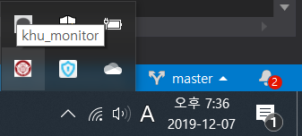
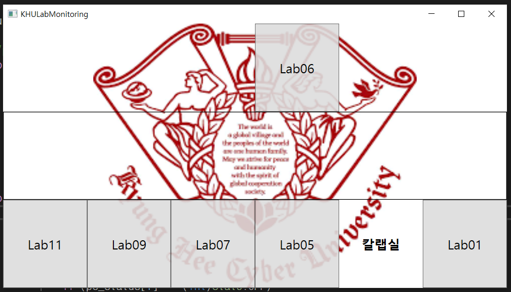
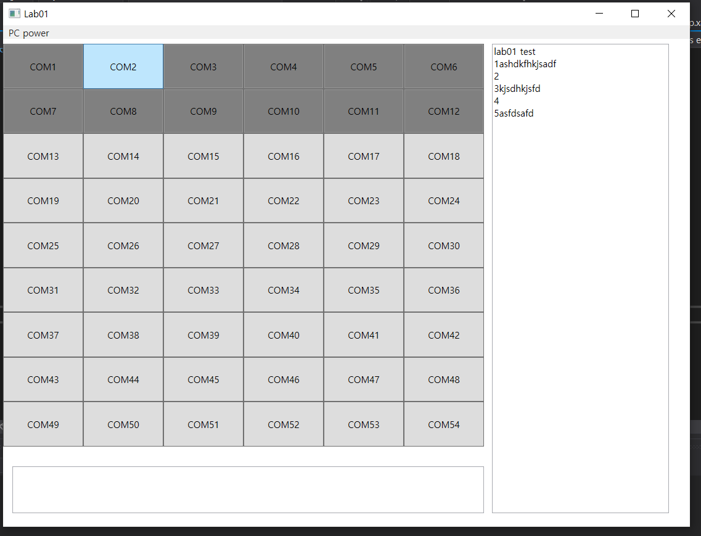
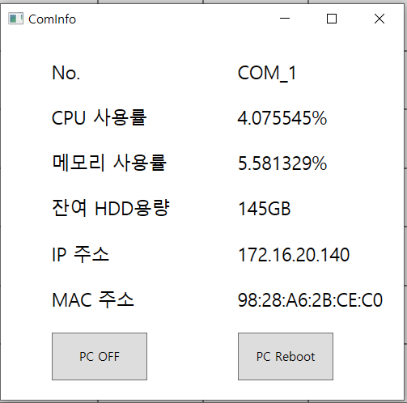

# khu-lab-monitoring

### Member
- JHyunB : (주)로직 설계 및 디자인 (부) 통신
- euidong : (주)통신 및 로직 설계 (부) 디자인
- wjlee0908 : 유지 보수 시스템 ui 변경 및 리팩토링 

### Goal 
- 교내 pc 제어 프로그램 
  - set PC ON / OFF
    - PC ON은 학교 내 보안 문제로 Port forwarding 불가능으로 구현 제한.
  - catch PC Suspend mode
  - add tray bar
  - get data CPU/RAM/HDD from PC
  - implement memo stage
  
  2차 유지보수 사항
  - server 불안정 버그 수정
    - 갑작스러운 연결 종료 이슈 확인 및 수정
    - 전체 서버 코드의 비동기 작업 부적절한 작동 확인 및 수정
  - coding convension 통일을 통해서 코드 가독성 강화   

### Server 
- UDP 통신을 보내는 대상
- GUI 구현(tray, mainView, subView, comInfo)
  - tray : 상태바 아이콘
  
  
  - mainWindow : 전체 랩실을 보여줌.
  
  
  - subWindow : 랩실 하나의 모습을 보여줌. 
  memo 창 구현.(컴퓨터와 lab실의 정보를 저장하기 위한 memo 창)
  
  
  - comInfo : pc하나의 상태를 보여줌.
  

### Client 
- UDP 통신을 받을 준비를 계속하고 있는다.
- pc의 정보를 보낼 준비를 하고 있음.
- 요청이 들어오면 바로 전송.
- suspend mode를 catch하고 server에게 signal.
